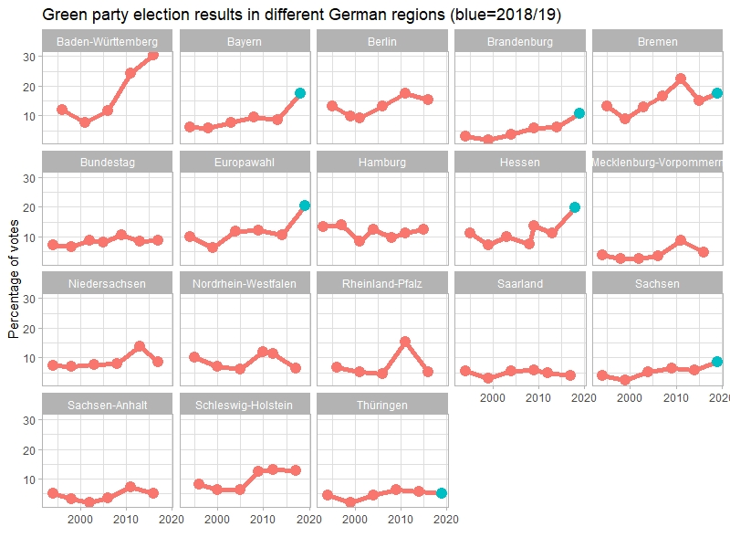

# Green party election results
### using webscraping with rvest in wikipedia

For a presentation for the Green Initiatives Team at work I wanted to show how green parties gain more and more votes. I found a table containing all the results from the German green party "Die Grünen" in Wikipedia ([link](https://de.wikipedia.org/wiki/Liste_der_Wahlergebnisse_und_Regierungsbeteiligungen_von_B%C3%BCndnis_90/Die_Gr%C3%BCnen)). A great opportunity to use the power of the rvest package to scrape the information and clean the resulting dataframe.

This is the plot I produced:

